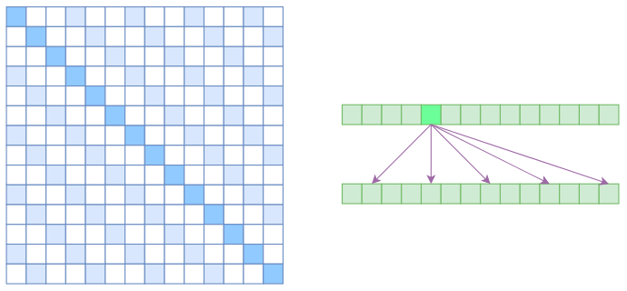
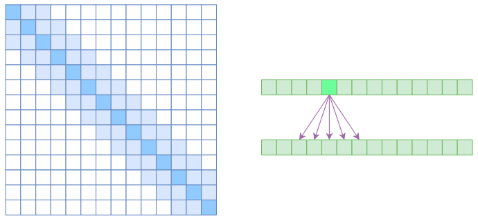
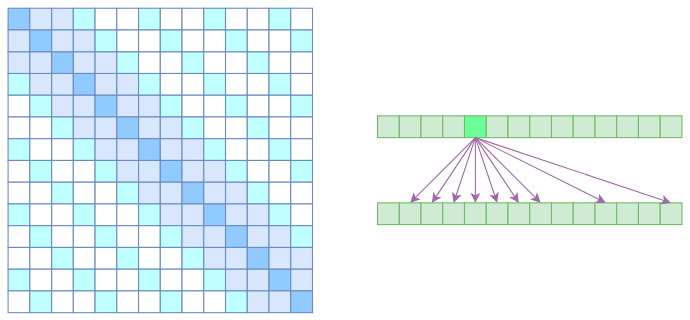
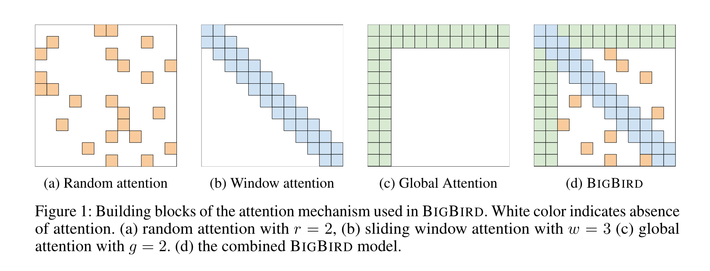

# Sparse Attention

## Sparse Attention

由于 Self-Attention 中的计算复杂度是 $O(n^2)$，因此内存和计算的负载很大。原因在于 Self-Attention 中的每个元素都跟序列中的所有元素关联。要节省显存，加快计算速度，一个基本的思路就是减少关联性的计算，也就是认为每个元素只跟序列内的一部分元素相关，这就是 **Sparse Attention 的基本原理**。

### Atrous Self Attention

中文叫“膨胀自注意力”，“空洞自注意力”，它对相关性进行了约束，强行要求每个元素只跟它相对距离为 k, 2k, 3k, ..., nk 的元素关联，其中 k 是预先设定的超参数。



每个元素只跟大约 $n/k$ 个元素相关，这样运行效率和显存占用都变成了 $O(n^2 / k)$，也就是说能直接降低到原来的 $1/k$。

### Local Self Attention

中文叫做 “局部自注意力”。约束每个元素只与前后 k 个元素以及自身有关，如下图所示。



Local Self Attention 保留一个 $2k+1$ 大小的滑动窗口，然后只保留窗口内的自注意力。每个元素只和 $2k+1$ 个元素有关，这样显存占用和计算量变为 $O((2k+1)n) ~ O(kn)$。但是直接牺牲了长程关联性。

### Sparse Attention

这里指的是 OpenAI 的 Sparse Attention: 《Generating Long Sequences with Sparse Transformers》。Atrous Self Attention 是带有一些洞的，而 Local Self Attention 用来填补这些洞。OpenAI 直接将两个 Atrous Self Attention 和 Local Self Attention 合并为一个。




## Big Bird

BigBird 所关注的问题：

- 能否使用更少的内积来完成完全自注意力的经验优势？
- 这些稀疏注意力机制是否保留了原始网络的表达能力和灵活性？

### BigBird Architecture



BigBird 可以由三部分组成：Random Attention + Window Attention + Global Attention。

对于 Global Attention，每一个 query 都和其他所有 tokens 关联，并且也被其他所有 tokens 关联。

```
# pseudo code

Q -> Query martix (seq_length, head_dim)
K -> Key matrix (seq_length, head_dim)

# 1st & last token attends all other tokens
Q[0] x [K[0], K[1], K[2], ......, K[n-1]]
Q[n-1] x [K[0], K[1], K[2], ......, K[n-1]]

# 1st & last token getting attended by all other tokens
K[0] x [Q[0], Q[1], Q[2], ......, Q[n-1]]
K[n-1] x [Q[0], Q[1], Q[2], ......, Q[n-1]]

```

对于 Sliding Attention，关键词元被拷贝两次，向右拷贝一次，向左拷贝一次，计算复杂度为 $O(3 \times n)$。

```
# what we want to do
Q[i] x [K[i-1], K[i], K[i+1]] for i = 1:-1

# efficient implementation in code (assume dot product multiplication 👇)
[Q[0], Q[1], Q[2], ......, Q[n-2], Q[n-1]] x [K[1], K[2], K[3], ......, K[n-1], K[0]]
[Q[0], Q[1], Q[2], ......, Q[n-1]] x [K[n-1], K[0], K[1], ......, K[n-2]]
[Q[0], Q[1], Q[2], ......, Q[n-1]] x [K[0], K[1], K[2], ......, K[n-1]]

# Each sequence is getting multiplied by only 3 sequences to keep `window_size = 3`.
# Some computations might be missing; this is just a rough idea.
```

每个查询标记会关注一些随机标记，对于实际实现，这意味着模型会随机收集一些标记并计算它们的注意力分数。

```
# r1, r2, r are some random indices; Note: r1, r2, r3 are different for each row 👇
Q[1] x [Q[r1], Q[r2], ......, Q[r]]
.
.
.
Q[n-2] x [Q[r1], Q[r2], ......, Q[r]]

# leaving 0th & (n-1)th token since they are already global

```

## References

- 为节约而生：从标准Attention到稀疏Attention, https://spaces.ac.cn/archives/6853#Sparse%20Self%20Attention
-  Big Bird: Transformers for Longer Sequences, https://arxiv.org/abs/2007.14062
- Understanding BigBird's Block Sparse Attention, https://huggingface.co/blog/big-bird