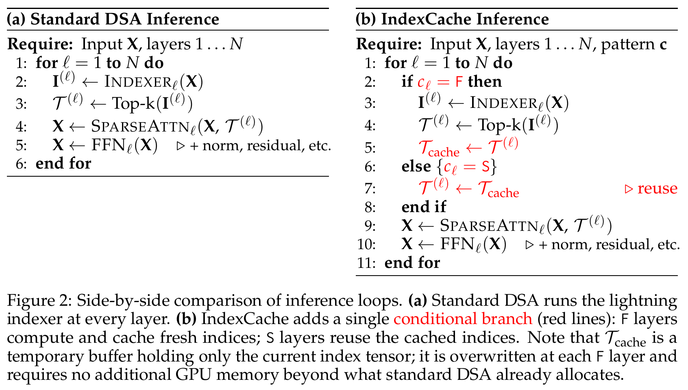
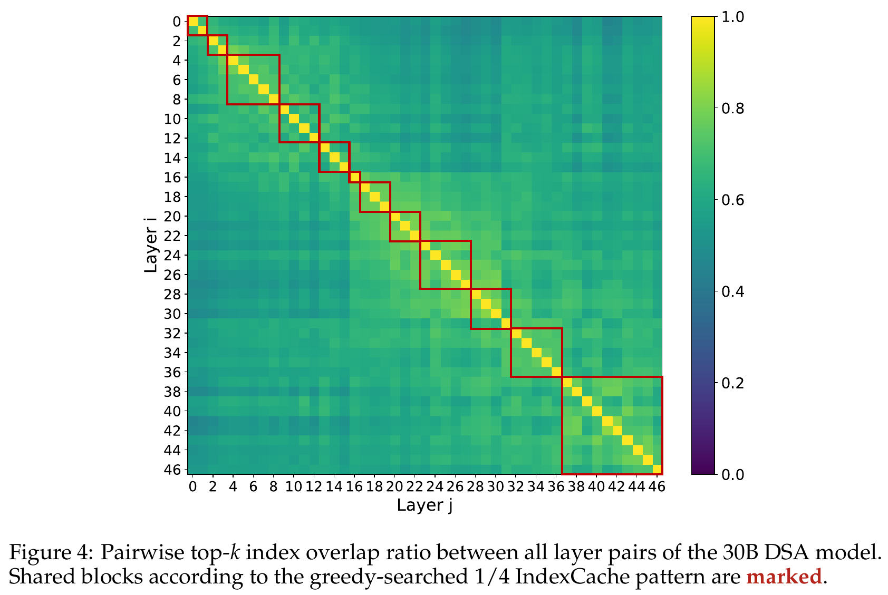
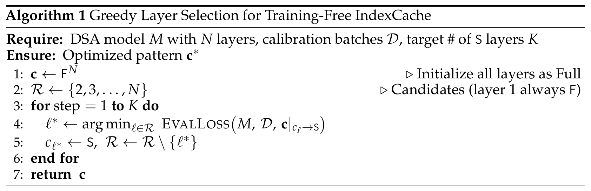
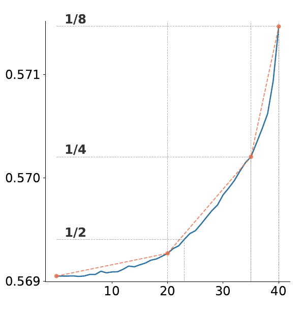
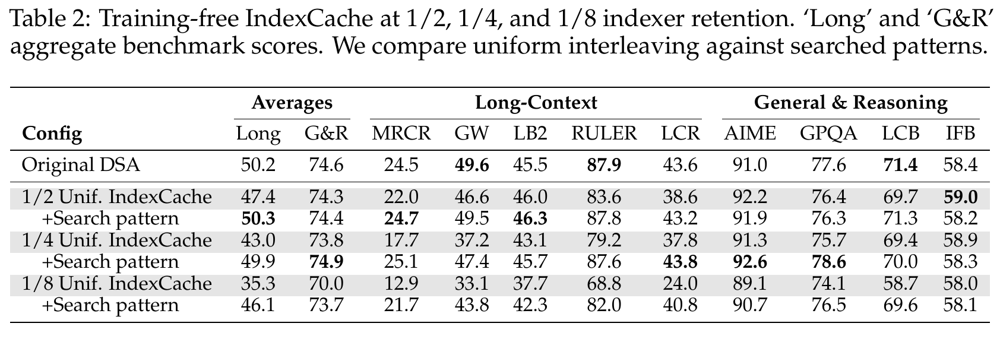
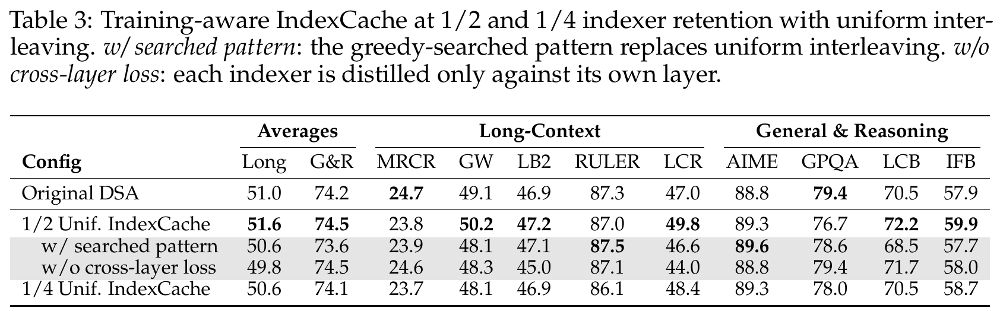
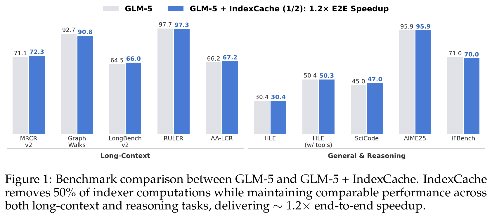
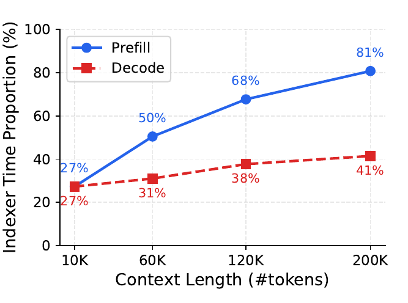
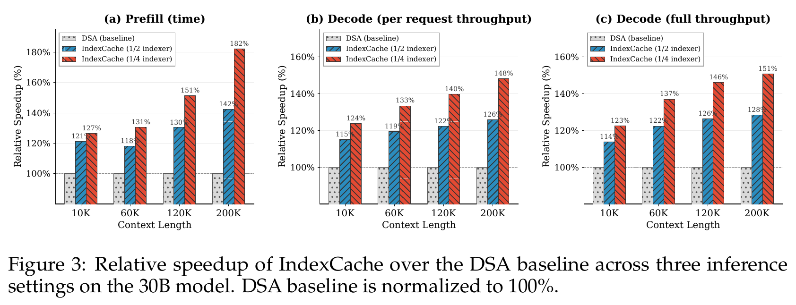
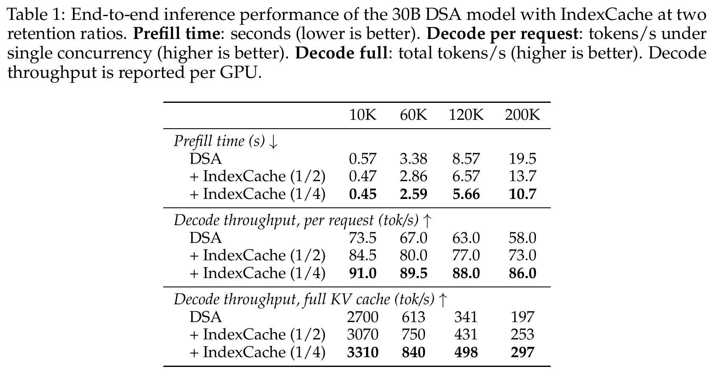

---
tags:
  - papers/LLM
  - topics/sparse-attention
  - topics/indexer
  - topics/knowledge-distillation
  - topics/kv-cache
aliases:
  - "IndexCache"
  - "IndexShare"
date: 2026-09-15
---

# IndexCache：跨层复用稀疏索引，以及它为什么能被训练

> 论文：[IndexCache: Accelerating Sparse Attention via Cross-Layer Index Reuse](https://arxiv.org/abs/2603.12201v1)，Yushi Bai、Qian Dong 等，清华大学 / Z.ai，2026-03-12，arXiv v1。
>
> 本笔记按阅读讨论中的疑问组织：共享什么、为什么可以共享、KL 如何训练 indexer、Top-k 如何变化，以及计算和缓存分别省在哪里。实验数字与原图均以这版 PDF 为准；GLM-5.2 的 IndexShare 命名及实现是另行核对的补充资料。
>
> 关联笔记：[DSA 算法流程](../deepseek-dsa/deepseek-sparse-attention-dsa.md) · [MSA 与 DSA Indexer 对比](../minimax-msa/msa-vs-dsa-indexer.md) · [HiSparse](../hisparse/hisparse.md)

## 1. 一句话结论

**相邻层常常需要读取相似的历史 token，因此可以共用 Top-k 位置清单，每层再用自己的 Q、K、V 独立计算主 attention。**

IndexCache 通过搜索共享模式，或通过多层 KL 蒸馏训练，使这种复用在实验中保持接近原始 DSA 的质量，同时减少 indexer 的执行次数。

三个边界必须一起记住：

- 共享的是位置，主 attention 的权重、输出与各层 KV 仍然不同。
- 数学命题证明多层蒸馏与平均教师目标的梯度等价，没有证明共享 Top-k 必然无损。
- 主要收益是 indexer 计算减少；S 层的 indexer K cache 也可省掉，主 attention KV cache 不因该机制本身而缩小。

## 2. Indexer、IndexCache、IndexShare 分别是什么？

### 2.1 先分开打分网络与 Top-k

| 对象 | 做什么 | 是否有可训练参数 |
|---|---|---|
| Lightning Indexer 的打分网络 | 从输入表示生成检索 query、key、head 权重，计算候选分数 | 有 |
| Top-k 操作 | 从分数中选出最高的 k 个位置 | 没有 |
| Index / 位置清单 | 例如 `[3, 8, 19, …]` 的整数位置 | 不是模型参数 |
| Main Attention | 在所选位置上重新计算正式 attention | 有自己的参数 |

“Indexer 根据分数选择 Top-k”容易省略最重要的一步：**分数本身由可训练的小网络产生。** 只拿现成分数做 Top-k 的选择器没有参数，但 DSA 额外引入了可训练的 Lightning Indexer。

DSA 的候选打分为：

$$
I_{t,s}=\sum_{j=1}^{H_I}w^I_{t,j}\operatorname{ReLU}\left((q^I_{t,j})^\top k^I_s\right).
$$

$t$ 为当前 query 位置，$s$ 为候选位置，$j$ 为 indexer head。$q^I$、$k^I$ 是检索向量，$w^I$ 是根据当前输入生成的动态 head 权重，最终每个 token pair 只有一个标量分数。[DeepSeek-V3.2 §2.1](https://arxiv.org/html/2512.02556v1#S2.SS1)

### 2.2 IndexCache 的 F / S 层

| 层类型 | Indexer | 主 attention |
|---|---|---|
| F：Full | 执行本层打分和 Top-k，缓存新位置清单 | 在新清单上执行 sparse attention |
| S：Shared | 跳过，使用最近一个前置 F 层的清单 | 在继承清单上执行本层 sparse attention |

**Full 指完整执行 indexer，不代表主 attention 变回 dense。** 第一层必须为 F，以产生初始清单。

例如 `FSSS FSSS`：

```text
Layer 1：Indexer₁ → T₁ → Attention₁(T₁)
Layer 2：          T₁ → Attention₂(T₁)
Layer 3：          T₁ → Attention₃(T₁)
Layer 4：          T₁ → Attention₄(T₁)
Layer 5：Indexer₅ → T₅ → Attention₅(T₅)
```



*原论文 Figure 2，PDF 第 3 页。缓存的是当前 index tensor，遇到下一个 F 层即覆盖；它不是保存历次选择的长期缓存。*

这里的“算一次”是同一 query 在一组层内算一次。其他 query、新生成的 token、下一个 F 层仍然会重新选择。[IndexCache §3](https://arxiv.org/abs/2603.12201v1)

### 2.3 IndexShare 与 IndexCache 的关系

这版论文没有使用 IndexShare 这个名称。GLM-5.2 的官方模型卡将 **IndexShare** 直接链接到 IndexCache 论文，并描述为每四个 sparse attention 层复用一个 indexer。

因此，IndexCache 是本文的方法，IndexShare 是后续模型采用该跨层复用思想时使用的名称。论文还包括非均匀模式搜索；实际模型的例外层和分组应以配置为准，不能把示意的 `FSSS` 当成所有层无例外的配置。[GLM-5.2 模型卡](https://huggingface.co/zai-org/GLM-5.2) · [模型配置](https://huggingface.co/zai-org/GLM-5.2/blob/main/config.json)

## 3. Q、K、V 不同，为什么还能共享位置？

这两个事实并不矛盾：**不同层的表示不同，但可能需要读取同一批位置。**

以简化的单头 attention 表示，共享位置集合 $T_t$ 后，第 $\ell$ 层仍计算：

$$
o_t^{(\ell)}=
\sum_{s\in T_t}
\operatorname{softmax}_{s\in T_t}
\left(\frac{(Q_t^{(\ell)})^\top K_s^{(\ell)}}{\sqrt d}\right)
V_s^{(\ell)}.
$$

各层的 $Q^{(\ell)}$、$K^{(\ell)}$、$V^{(\ell)}$ 不同；即使位置相同，softmax 权重和输出也可不同。几层都读取“函数定义”和“调用位置”，仍然可以分别提取不同信息。

该公式用于解释共享的对象，省略了 MLA 的压缩、矩阵吸收等实现细节。共享没有让几层 attention 成为同一个计算。

### 3.1 论文的经验依据：跨层选择重合

作者对 47 层、30B DSA 模型，在 768 个长度为 200K 的校准样本上统计：

$$
\operatorname{overlap}(i,j)=\frac{|T^{(i)}\cap T^{(j)}|}{k},\qquad k=2048.
$$

相邻层重合率约为 70%–100%，并存在内部重合较高的层分组；早期层与后期层的选择则可能明显不同。



*原论文 Figure 4，PDF 第 16 页。亮色表示重合高；红框是贪心搜索得到的共享分组。红框与自然重合簇不完全一致，说明仅凭局部重合率无法确定最佳共享模式。*

这些是特定模型和数据上的观察，不是任意 Transformer 都满足的数学定理。[IndexCache Appendix A](https://arxiv.org/abs/2603.12201v1)

### 3.2 重合很多，不代表没漏掉关键 token

阅读讨论中的极端例子：

| 原候选 | 当前层原本的 attention weight |
|---|---:|
| A | 0.01 |
| B | 0.01 |
| C | 0.01 |
| D | 0.97 |

若复用的集合是 `{A, B, C, E}`，位置重合率有 75%，却漏掉了占主要权重的 D。

判断损失时，需要区分：

1. **位置重合率**：多少个位置相同。
2. **遗漏的 attention 概率质量**：被漏掉的 token 原本占多少 softmax 权重。
3. **实际输出变化**：还取决于相应 Value 的内容。
4. **最终任务影响**：还取决于误差如何在后续层传播。

讨论中的“token 对 attention score 的贡献”应精确为其 **softmax 后的 attention weight**；raw score / logit 是归一化前的值。

Appendix C 还报告了负结果：按局部 attention 输出余弦相似度搜索共享模式，无法有效恢复下游质量。局部输出相似不等于端到端误差小。

## 4. 不训练时：用 LM loss 搜索哪些层可以共享

Training-free IndexCache 固定权重，从全 F 模式开始，在同一批校准数据上：

1. 尝试将某个非首层 F 改为 S。
2. 运行整个模型，计算语言建模损失。
3. 提交损失最低的改法。
4. 重复，直到达到目标保留比例。



*原论文 Algorithm 1，PDF 第 5 页。比较的是真正执行该共享模式后的端到端 LM loss，不是仅比较两个层的 indexer 分数。*



*原论文 §3.1.2 未编号插图，PDF 第 5 页。开始时有不少影响较小的删除机会，进一步提高共享比例后损失增长更快。*

贪心算法不保证全局最优。它的价值在于用全局预测损失识别重要层，而不要求局部相似度一定能预测最终质量。[IndexCache §3.1](https://arxiv.org/abs/2603.12201v1)

## 5. 允许训练时：让 indexer 学习多个层的共同需求

### 5.1 多层 KL 监督

固定一个 query，设保留的 indexer 服务 $r$ 个层：

- $p^{(j)}$：第 $j$ 个服务层的主 attention 教师分布，跨 heads 聚合。
- $z_\theta$：共享 indexer 的连续候选分数。
- $\pi_\theta=\operatorname{softmax}(z_\theta)$：indexer 概率分布。

本笔记用 $\pi$ 表示概率，避免与检索向量 $q^I$ 混淆；论文将该概率记作 $q$。

$$
\mathcal L_{\mathrm{multi}}=
\frac1r\sum_{j=1}^{r}D_{\mathrm{KL}}(p^{(j)}\|\pi_\theta).
$$

直觉：某个服务层很重视一个位置，而 indexer 给它很低的概率，该项 KL 就产生提高其预测概率的压力。多个层共同提出需求。

### 5.2 数学命题究竟证明什么？

定义平均教师：

$$
\bar p=\frac1r\sum_{j=1}^{r}p^{(j)}.
$$

当教师分布对 indexer 更新视为固定目标时，论文 Proposition 1 证明：

$$
\nabla_\theta\mathcal L_{\mathrm{multi}}
=\nabla_\theta D_{\mathrm{KL}}(\bar p\|\pi_\theta).
$$

因为：

$$
D_{\mathrm{KL}}(p\|\pi_\theta)
=\sum_s p_s\log p_s-\sum_s p_s\log\pi_{\theta,s},
$$

第一项不对 indexer 参数求导；平均各层第二项，正好得到 $-\sum_s\bar p_s\log\pi_{\theta,s}$。两个损失的数值不必相等，但针对 indexer 的梯度相同。[IndexCache §3.2，式 1–3](https://arxiv.org/abs/2603.12201v1)

**命题解释 indexer 在拟合平均需求，没有证明共享 Top-k 与各层独立选择等价，也没有证明准确率必然不下降。**

### 5.3 平均需求仍然可能牺牲某一层

| 分布 | A | B | C |
|---|---:|---:|---:|
| 第 1 层 | 0.8 | 0.2 | 0 |
| 第 2 层 | 0.2 | 0.1 | 0.7 |
| 平均 | 0.5 | 0.15 | 0.35 |

即使 indexer 完美拟合平均分布，Top-1 仍选择 A，而第 2 层最需要的 C 被漏掉。A 的平均原始概率覆盖量为 0.5，C 为 0.35；平均更好不等于每层都满意。

Top-2 可同时选 A、C，说明候选预算也是共享是否有效的关键条件。真实实验用 $k=2048$，但这个数本身并不提供无损保证。

## 6. Indexer 的参数 θ 在哪里？

DeepSeek 官方实现中的主要可训练模块包括：

| 模块 | 作用 |
|---|---|
| `indexer.wq_b` | 将输入的低秩 query 表示投影成 indexer queries |
| `indexer.wk` | 将 hidden states 投影成 indexer keys |
| `indexer.weights_proj` | 根据当前输入生成各 indexer head 的动态权重 |
| `indexer.k_norm` | 对 indexer keys 做带可学习参数的归一化 |

这里的参数是线性层权重矩阵和归一化参数等。小写 $w^I_{t,j}$ 是本次输入生成的动态数值；生成它的 `weights_proj` 矩阵才是优化器更新的参数。[DeepSeek 官方 Indexer 实现](https://huggingface.co/deepseek-ai/DeepSeek-V3.2-Exp/blob/main/inference/model.py)

主 attention 和 indexer 使用不同的检索/注意力投影。不能把“KL 更新 indexer 的 Wq/Wk”理解成“这条 KL 直接训练主 attention 的全部 Q/K 参数”。

## 7. KL 怎样更新 Wq、Wk？

本节是讨论中使用的简化链式法则推导，用于理解梯度路径；它不是完整 DSA kernel 的 backward。

### 7.1 先看单头、无 ReLU 的情况

使用列向量，令 $x\in\mathbb R^{d_x}$ 为 query 侧输入，$h_s\in\mathbb R^{d_h}$ 为候选输入，$W_q\in\mathbb R^{d_I\times d_x}$、$W_k\in\mathbb R^{d_I\times d_h}$：

$$
q=W_qx,\qquad k_s=W_kh_s,\qquad z_s=q^\top k_s.
$$

$$
\pi=\operatorname{softmax}(z),\qquad
\mathcal L=D_{\mathrm{KL}}(p\|\pi).
$$

教师作为固定目标时：

$$
\delta_s\equiv\frac{\partial\mathcal L}{\partial z_s}=\pi_s-p_s.
$$

若 indexer 低估某位置，$\delta_s<0$，梯度下降有提高该分数的方向；若高估，则方向相反。共享网络的联合更新会耦合不同位置，因此不能保证每一步每个分数都按独立变量的理想方向变化。

点积的 backward 为：

$$
\frac{\partial\mathcal L}{\partial q}=\sum_s\delta_sk_s,
\qquad
\frac{\partial\mathcal L}{\partial k_s}=\delta_sq.
$$

再经过线性投影：

$$
\boxed{\frac{\partial\mathcal L}{\partial W_q}
=\left(\sum_s\delta_sk_s\right)x^\top}
$$

$$
\boxed{\frac{\partial\mathcal L}{\partial W_k}
=\sum_s\delta_sq\,h_s^\top}
$$

它们都是“输出梯度 × 输入转置”的外积。$W_k$ 在候选之间共享，所以要累加候选贡献；完整 batch 还需累加或平均多个 query / 样本的贡献。

### 7.2 一个局部梯度数值例子

假设两个候选的 $\pi=(0.7,0.3)$、$p=(0.2,0.8)$，则 $\delta=(0.5,-0.5)$。取：

$$
x=\begin{bmatrix}1\\0\end{bmatrix},\quad
k_A=\begin{bmatrix}1\\0\end{bmatrix},\quad
k_B=\begin{bmatrix}0\\1\end{bmatrix}.
$$

于是：

$$
\frac{\partial\mathcal L}{\partial W_q}
=\begin{bmatrix}0.5\\-0.5\end{bmatrix}
\begin{bmatrix}1&0\end{bmatrix}
=\begin{bmatrix}0.5&0\\-0.5&0\end{bmatrix}.
$$

SGD 更新会让 $W_q$ 第一列的第一维减小、第二维增大，使该输入产生的 query 沿 $k_B-k_A$ 方向移动。这里展示的是一处局部梯度；实际更新也会同时影响其他输入、key 和网络参数。

### 7.3 接回多头 ReLU 打分

若：

$$
z_s=\sum_jw_j\operatorname{ReLU}(q_j^\top k_s),
$$

则：

$$
\frac{\partial\mathcal L}{\partial q_j}
=\sum_s\delta_sw_j\mathbf1[q_j^\top k_s>0]k_s.
$$

ReLU 提供梯度开关，$w_j$ 提供缩放；key 侧累加各 head 的贡献，再经过实际实现中的 RoPE、归一化、投影等操作反传。完整 kernel 推导还需包含实际缩放、精度和张量布局。

多层 KL 只把此处的 $p_s$ 换成 $\bar p_s$，即 $\delta_s=\pi_s-\bar p_s$。整条路径是：

```text
多层 KL → 连续候选分数 → indexer query / key → 投影参数
```

## 8. Top-k 不可微，为什么训练后清单会变化？

### 8.1 KL 提供另一条路径

```text
Indexer 分数 z
  ├─ Top-k → 整数位置 → 主 attention → LM loss
  │           常规梯度无法穿过离散位置选择
  └─ Softmax → 概率分布 → KL loss → 更新 indexer
```

主 attention 不使用 indexer 分数作为自己的权重，因此 LM loss 没有从这条位置选择路径回传给 indexer 的常规可微通道。KL 直接监督选择前的连续分数，并没有让 Top-k 本身变得可微。KL 是本文选择的方法，不是离散选择训练的唯一可能方案。

### 8.2 更新参数，下一次前向重新选择

以 SGD 示意：

$$
\theta' = \theta-\eta\nabla_\theta\mathcal L,
\qquad
T'=\operatorname{TopK}(\operatorname{Indexer}_{\theta'}(h')).
$$

| 状态（示意，固定输入观察） | A 分数 | B 分数 | Top-1 |
|---|---:|---:|---|
| 更新前 | 0.60 | 0.40 | A |
| 若干更新后 | 0.53 | 0.47 | A |
| 排名越过边界后 | 0.48 | 0.52 | B |

优化器更新的是产生分数的参数，而不是直接修改分数表或整数位置。分数连续变化，排名跨过边界后，下一次 Top-k 输出发生离散变化。

一次前向中，F 层产生的清单供后续 S 层使用；反向完成后不会回头改写已经执行过的这次前向。下一次训练前向通常也换了 batch，$h'$ 不一定与原输入相同。

推理时没有 KL 和参数更新，但输入、query、层号变化仍会导致新的选择。**参数固定不等于清单固定。**

### 8.3 两阶段训练与梯度边界

| 阶段 | 主 attention | Indexer 监督 | 参数更新 |
|---|---|---|---|
| Dense warm-up | 保持 dense | 多个服务层的全序列教师分布 | 冻结其余参数，只训练保留的 indexer |
| Sparse training | 使用共享 Top-k | KL 只在选中的 Top-k token 上计算 | Indexer 用 KL；主模型其他参数用 LM loss |

教师作为固定目标，indexer 输入按 DSA 训练方式 detach，避免 KL 沿该输入路径更新主模型。后续 S 层的 KL 可沿共享预测分布的可微路径反传到 F 层 indexer，并不要求 F 层在前向时提前知道后续层的结果。

**稀疏阶段的监督范围有限**：不能把它描述成每一步都能直接纠正所有漏选 token。前面“提高 B 分数”的完整分布例子，要求 B 在 KL 的监督范围内。[IndexCache §3.2](https://arxiv.org/abs/2603.12201v1) · [DSA §2.1.1](https://arxiv.org/html/2512.02556v1#S2.SS1.SSS1)

## 9. 实验究竟支持了哪些结论？

### 9.1 免训练：共享模式很重要

**问题**：只删除 indexer、固定权重时，均匀共享是否足够？

**设置**：同一 30B DSA 模型、相同保留比例，比较均匀模式与 LM-loss 贪心搜索。Table 2 的 Long Avg 汇总五个长上下文基准。



*原论文 Table 2，PDF 第 8 页。*

| 配置 | 长上下文平均分 |
|---|---:|
| 原始 DSA | 50.2 |
| 1/4 均匀保留 | 43.0 |
| 1/4 搜索保留 | 49.9 |
| 1/8 搜索保留 | 46.1 |

**解释**：1/4 比例下搜索大幅缩小质量差距，直接均匀删除并不可靠；1/8 即使搜索也明显退化，存在共享边界。贪心搜索的结果不代表任何数据、模型或共享比例都能恢复质量。

### 9.2 允许训练：模型能适应共享，多层监督有额外帮助

**问题**：恢复质量只是重新训练的效果，还是多层 KL 也有作用？

**设置**：此组实验使用上下文长度为 200K tokens 的 SFT 数据，运行 1,000 步 dense warm-up 和 4,000 步 sparse training。其 DSA 基线也按该缩短流程训练，因此不能与 Table 2 的基线直接混作同一对照。



*原论文 Table 3，PDF 第 9 页。*

| 配置 | 长上下文平均分 |
|---|---:|
| 本组原始 DSA | 51.0 |
| 1/2 均匀共享 + 多层 KL | 51.6 |
| 1/2 均匀共享，仅 F 层自己的 KL | 49.8 |
| 1/4 均匀共享 + 多层 KL | 50.6 |

**解释**：相同 1/2 模式下去掉多层监督下降 1.8 个分数点，支持多层 KL 提供额外帮助；1/4 的均匀模式经训练后接近同组基线。该消融只在 1/2 上做，不能当成 1/4 的消融结论。

Table 3 的 51.0 → 50.6 是下降 **0.4 个分数点**，相对降幅约 0.78%，不应写成相对下降 0.4%。表中未报告误差条，不能仅因 51.6 略高于 51.0 就认定共享普遍提升能力。[IndexCache §4.1、§4.3–4.4](https://arxiv.org/abs/2603.12201v1)

### 9.3 更大模型的证据



*原论文 Figure 1，PDF 第 1 页：展示 GLM-5 保留 1/2 indexer 时多个任务的对比，标注约 1.2 倍端到端加速。*

Table 4 还给出 GLM-5 的免训练长上下文结果：基线 78.4，1/4 搜索模式 78.0。它支持方法在更大模型上的可行性，但论文明确将其称为 preliminary results。图 1 的 1/2、30B Table 1 的 1/4，以及正文 GLM-5 长上下文 1/4 的加速描述属于不同配置，不能拼接成同一个实验结果。

## 10. 为什么省掉 75% indexer，没有整体加速 4 倍？

### 10.1 Indexer 在长上下文中可能成为大头

Prefill 阶段，固定 Top-k 预算时：

| 部分 | 跨 N 层的主要规模 |
|---|---|
| 标准 DSA indexer 打分 | $O(NL^2)$ |
| Sparse Main Attention | $O(NLk)$ |
| IndexCache indexer 打分 | $O(N_F L^2)$ |

$N_F$ 是保留的 F 层数。Indexer 单次打分便宜，但候选对数量增长更快；“Main Attention”这个名字不能用来判断耗时占比。



*原论文 Introduction 未编号插图，PDF 第 2 页。该 profile 在 200K 时给出的 indexer 占比为 prefill 81%、decode 41%；它体现瓶颈随上下文长度变化，不能无视运行配置直接与其他实验拼算加速。*

Decode 每次只新增少量 query；单 token 的候选扫描随历史长度近似线性增长，不应把 prefill 的 $L^2$ 直接当成单 token decode 的复杂度。

### 10.2 Amdahl 定律解释端到端收益

设原耗时中 indexer 占比为 $f$，保留 1/4 次数，并理想化地假设其耗时按比例缩小、其他部分不变：

$$
\operatorname{speedup}=\frac1{(1-f)+f/4}.
$$

例如假设原本 indexer 60 ms、其他 40 ms，优化后变成 15 + 40 = 55 ms，总加速约 1.82 倍。此例只解释原理，不是论文实测时间的分解。

### 10.3 实测数字与配置



*原论文 Figure 3，PDF 第 8 页，基线归一化为 100%；182% 对应 1.82 倍速度，不是额外提升 182%。*



*原论文 Table 1，PDF 第 7 页。30B 模型，SGLang，H100 节点，DP attention size=8。单请求 decode 为每 GPU 单请求；full throughput 为 KV cache 充分占用时的每 GPU 吞吐。*

200K 上下文、保留 1/4 indexer：

| 指标 | DSA | IndexCache | 对应收益 |
|---|---:|---:|---|
| Prefill 延迟 | 19.5 s | 10.7 s | 约 1.82 倍速度，延迟减少约 45.1% |
| 单请求 decode | 58 token/s | 86 token/s | 约 1.48 倍吞吐 |
| 缓存充分占用时总 decode | 197 token/s/GPU | 297 token/s/GPU | 约 1.51 倍吞吐 |

IndexCache 降低了 indexer 二次项的系数，未消除保留层的全候选扫描，也不是把整个模型的 FLOPs 或延迟都减少 75%。[IndexCache §4.2](https://arxiv.org/abs/2603.12201v1)

## 11. IndexShare 会减少 KV Cache 吗？

### 11.1 三类状态不能混在一起

| 状态 | 内容 | 跨层共享后的变化 |
|---|---|---|
| Main Attention KV cache | 各层历史 K/V；优化的 MLA 实现可保存压缩 latent 等表示 | 各层仍需保留 |
| Indexer K cache | 历史候选的检索向量 $k_s^I$ | S 层可以省掉自己的这一份 |
| 当前 Top-k 清单 | 整数位置 | F 层生成，后续 S 层复用 |

**Indexer 只有用于检索打分的历史 keys，没有主 attention 那样的 Value 加权求和分支，因此更精确地叫 indexer K cache。**

同一清单 `[3, 8, 19]` 在 Layer 1 和 Layer 2 中索引的是各层自己的不同内容。当前位置未被选中，也可能被下一个 query 选中，所以 Top-2048 不意味着只需保存 2048 个历史 token。

### 11.2 哪部分容量能省？

假设原来的缓存为：

$$
M_{\mathrm{total}}=M_{\mathrm{main\ KV}}+M_{\mathrm{indexer\ K}}.
$$

在各层 indexer K 大小相同、保留比例为 $r$，并忽略临时空间、元数据和对齐时：

$$
M_{\mathrm{shared}}\approx M_{\mathrm{main\ KV}}+rM_{\mathrm{indexer\ K}}.
$$

因此保留 1/4 indexer，可以省约 75% 的 **indexer K cache**，不是省掉总 KV cache 的 75%。实际显存节省还取决于精度、缓存表示及引擎是否避免为 S 层分配该空间。

这是由机制及实现得到的缓存分析，不是原论文报告的一个总显存实测降幅。核对的 Transformers 实现中，Shared 层将 `indexer` 设为 `None`；主 KV 仍每层更新，indexer keys 只在执行 indexer 的层更新。[GLM IndexShare 实现](https://github.com/huggingface/transformers/blob/main/src/transformers/models/glm_moe_dsa/modeling_glm_moe_dsa.py)（核对日期：2026-09-15）

### 11.3 与 MLA、HiSparse 的关系

| 方法 | 主要改变什么 |
|---|---|
| MLA | 每个 token 的主 KV 表示大小 |
| DSA | 每步主 attention 读取的候选数 |
| IndexCache / IndexShare | 运行 indexer 的层数及对应 indexer K 状态 |
| HiSparse | 主 KV 在 GPU 中的驻留量，完整历史仍可在主机中保留 |

这些方法作用于不同维度，机制上可互补；具体组合效果需要系统实现与测试。[HiSparse 阅读笔记](../hisparse/hisparse.md)

## 12. 读完以后应保留的判断

1. **有效性的起点是经验观察**：相邻层选择相似，但遗漏少量关键 token 仍可能造成明显影响。
2. **免训练与允许训练是两条路线**：前者搜索共享模式，后者让 indexer 与主模型一起适应；不要要求两者都必须做。
3. **数学依据有明确边界**：多层 KL 的梯度等价于平均教师监督；平均需求不保证每层需求都满足。
4. **训练不必对 Top-k 求导**：连续打分分支接受 KL，更新参数后重新打分与排序。
5. **实验支持有条件的近似保持质量**：1/4 的结果较好，免训练 1/8 出现退化；无误差条的小幅提升不能当成普遍增益。
6. **加速与缓存需要分别记账**：主要省 indexer 计算，可省 S 层 indexer K，主 KV 不因共享位置而减少。

### 可选练习：需要完整手推 backward 吗？

为了读懂论文，不必先完成全部数学推导。实现或调试训练时，可以先手推“KL → logits → 点积 → 线性层”这个最小版本，再与 autograd 核对。编写自定义 backward kernel 时，才需要补齐实际归一化、ReLU、缩放、精度与布局等全部细节。

本次阅读已覆盖核心机制、训练路径、理论边界、主要实验和推理缓存；完整 kernel backward 的独立推导可作为后续练习。

## 13. 原图与来源

笔记内的 10 张 PNG 均从用户提供的原论文 PDF 以 300 DPI 渲染裁切，包含全部 4 张编号 Figure、2 张未编号插图、Algorithm 1 和 Table 1–3。未重绘或修改图内数据。页码、裁切框及原 PDF SHA-256 记录在 同目录的 `images/sources.json` 来源清单。

- [IndexCache 原论文 v1](https://arxiv.org/abs/2603.12201v1)：机制、Proposition 1、实验与原图。
- [DeepSeek-V3.2 原论文](https://arxiv.org/html/2512.02556v1)：Lightning Indexer 打分与两阶段训练。
- [DeepSeek 官方推理代码](https://huggingface.co/deepseek-ai/DeepSeek-V3.2-Exp/blob/main/inference/model.py)：indexer 投影、归一化与独立 K cache。
- [GLM-5.2 官方模型卡](https://huggingface.co/zai-org/GLM-5.2)：IndexShare 命名及其与 IndexCache 的对应。
- [GLM-5.2 配置](https://huggingface.co/zai-org/GLM-5.2/blob/main/config.json)：实际 full / shared 层模式。
- [Transformers GLM-MoE-DSA 实现](https://github.com/huggingface/transformers/blob/main/src/transformers/models/glm_moe_dsa/modeling_glm_moe_dsa.py)：共享层的 indexer 与缓存路径。
