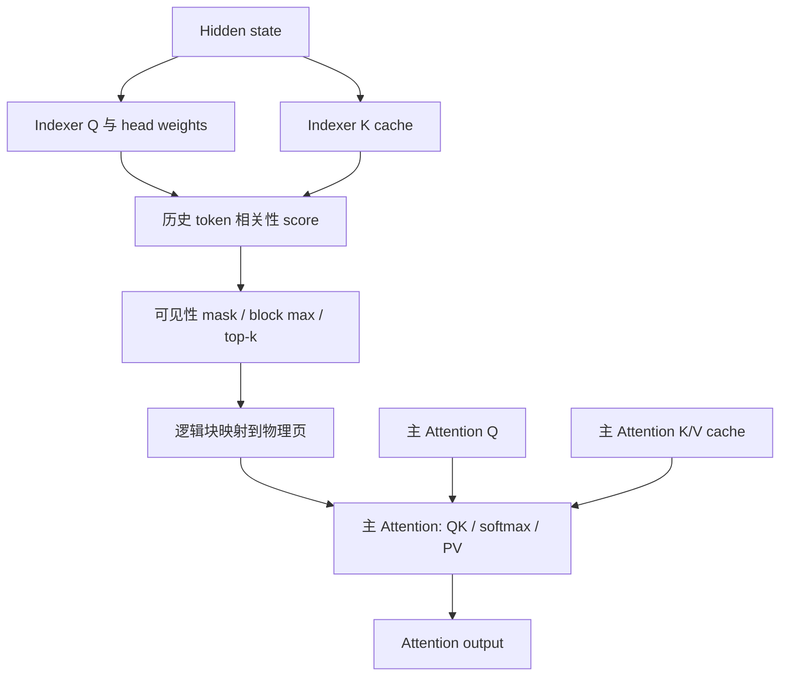

---
tags:
  - topics/sparse-attention
  - topics/source-reading
date: 2026-09-18
---

# DSA 前向路径：Indexer、块选择与分页 Attention

本文以“共享选块的 GQA 稀疏 Attention”为讨论条件，梳理 Indexer、Selection、页表与主 Attention 之间的数据关系。符号与伪代码用于解释机制，不绑定特定模型、部署配置或 SGLang 版本的完整调用签名。

配套阅读：[GQA 稀疏 Attention：共享 Selection 与计算形状](dsa-gqa-head-shapes.md)。

## 1. Indexer 与主 Attention 的职责



Indexer 产生用于选位置的分数；主 Attention 在选中位置上重新计算正式的 attention logits，并对 V 加权求和。两部分的 Q/K 应分别命名，不能把 indexer score 当作主 Attention 的 softmax 权重。

| 记号 | 含义 |
| --- | --- |
| N | 当前 query token 行数 |
| Hᵢ、Dᵢ | Indexer 的 head 数和 head dimension |
| Hq、Hkv | 当前设备上主 Attention 的 Q / KV head 数 |
| Dq、Dv | 主 Attention 的 QK / V 特征维度 |
| B | 每个 KV block 的 token 数 |
| T | 每个 query 选择的 block 数上限 |

一个请求在 prefill 或 verify 中可以对应多个 query 行，所以 N 不等于请求 batch size。

## 2. Indexer score 的一种公开形式

Lightning indexer 的 weighted-ReLU MQA score 可表示为：

$$
r_{t,j}=\alpha\sum_{a=1}^{H_i}w_{t,a}\operatorname{ReLU}\left(q^I_{t,a}\cdot k^I_j\right).
$$

其中 $q^I$、$k^I$ 是 indexer 的 Q/K，$w$ 是 head 权重，$\alpha$ 表示采用的缩放约定。对 head 的归约完成后，输出是每个 query 对历史位置的一个 score。公开的 [DeepGEMM MQA scoring 接口](https://github.com/deepseek-ai/DeepGEMM#v32-mqa-kernels-for-the-indexer)提供这一类打分，并区分 paged 与 non-paged 形式。

FP8 路径需要同时处理量化数据和 scale。投影、位置编码、量化、写 cache、打分、选块是不同职责；一个 Python 调用不一定对应一个 GPU kernel，融合 kernel 也不意味着整条 Indexer 路径已经融合。

主 Attention 的 Hq/Hkv 与 indexer 的 Hᵢ 是不同参数。某个 scorer 的 head 对齐限制不能直接当作主 Attention kernel 的限制。

## 3. 从 token score 得到 block Selection

对按 block 选择、使用 max pooling 的形式，定义 query t 的可见集合为 $\mathcal V_t$，block b 的位置集合为 $\mathcal B_b$：

$$
r'_{t,j}=\begin{cases}r_{t,j},&j\in\mathcal V_t,\\-\infty,&\text{otherwise},\end{cases}
\qquad m_{t,b}=\max_{j\in\mathcal B_b}r'_{t,j}.
$$

然后沿 block 维做 top-k，得到逻辑块号。先处理可见性，再做 block max，可保证未来位置不会影响当前块的分数。

```python
# 机制伪代码：省略 dtype、padding 和有效块数处理
visible_scores = token_scores.masked_fill(~visible, -float("inf"))
block_scores = visible_scores.reshape(N, num_blocks, B).amax(-1)
selected_blocks = block_scores.topk(min(T, num_blocks), dim=-1).indices
```

top-k 的 index 是逻辑块号，不是物理 cache 页号。若可见块少于 T，还需要约定有效数量或无效 sentinel；不能把填充项解释成真实 KV。

这是 block-max 选块形式的定义。其他算法可以按 token 选择、采用其他 pooling，或使用不同的 head/group Selection 语义，不能从“DSA”这个名称推断它们相同。

## 4. 逻辑块与物理页

分页 KV cache 通过请求页表把逻辑块映射到物理页。若 block 和 cache page 大小一致，映射关系可写成：

```text
selected physical page[t, k]
    = request page table[request_of(t), selected logical block[t, k]]
```

这个步骤只重组页号，不要求把选中的 K/V 复制到一块新的连续显存。

如果接口用“页表 + 一个有效长度”表示选中集合，且只有最后一个有效页可以不满，则被选中的当前尾页需要放在有效页表末尾。举一个与模型配置无关的页表示例：page size=4，历史长度=10，三个逻辑页的有效长度分别是 4、4、2。

| 选中的逻辑页 | 合适的页表顺序 | 选中 KV 的有效长度 |
| --- | --- | ---: |
| 2、0 | 0、2 | 6 |
| 0、1 | 0、1 | 8 |

因此稀疏有效长度不等于原请求长度，也不总是“选择页数 × page size”。上表仅演示页表语义，不表示某个设备 kernel 支持 page size=4。

## 5. 主 Attention 如何使用页表？

FlashAttention 的 KV-cache 接口支持分页 KV 与 GQA/MQA；具体参数名和支持范围应以所用版本为准。公开接口见 [FA3 Python API](https://github.com/Dao-AILab/flash-attention/blob/main/hopper/flash_attn_interface.py)。

在逐 query 页表的表示方式中，数据关系是：

| 输入 | 形状 | 含义 |
| --- | --- | --- |
| Q | `[N, Hq, Dq]` | 主 Attention query |
| K cache | `[num_pages, B, Hkv, Dq]` | 分页 Key |
| V cache | `[num_pages, B, Hkv, Dv]` | 分页 Value |
| page table | `[N, T]` | 各 query 选中的物理页 |
| cache lengths | `[N]` | 各 query 的稀疏 KV 有效长度 |
| cumulative query lengths | `[0,1,...,N]` | 各 query 表示为长度 1 的序列 |

“一个 query 一份页表”描述的是接口的数据组织，不表示为每个 token 发起一次 Python 调用或一次 GPU launch。

当每份页表和有效长度已经完整表达该 query 可见的历史位置时，主 Attention 可在这个集合内做非因果矩阵计算；原序列的因果约束由集合构造保证。只有满足这个前提，关闭 kernel 内部的 causal mask 才保留原有语义。

如果启用了 attention sink、softcap、位置偏置等机制，还需保留相应的数值定义。页表只能描述访问哪些 KV，不能替代这些计算。

## 6. 如何阅读 serving 框架中的对应代码？

可按以下职责查找实际版本的实现：

1. **模型 forward**：主 Q/K/V 与 indexer Q/K 分别由哪里产生。
2. **Indexer cache**：逻辑位置如何写入物理 slot，数据与 scale 如何存放。
3. **Score kernel 调用**：paged/non-paged 输入、可见长度和输出 score 形状。
4. **Selection**：mask、pooling、top-k 的顺序，以及是否包含 head/group 轴。
5. **页表适配**：请求归属、物理映射、尾页长度和 padding。
6. **Attention backend**：Q/K/V、页表、缩放与输出 buffer 如何传入设备 kernel。

仅确认 backend 名称，不能确定具体设备模板、MMA 形状、split 数或 launch 数。它们取决于所用构建和运行时分发，需要结合实际 kernel 记录判断。

## 7. 关联阅读

- [GQA 稀疏 Attention 的共享关系与计算形状](dsa-gqa-head-shapes.md)
- [DeepSeek Sparse Attention 算法流程](../../notes/llm/deepseek-dsa/deepseek-sparse-attention-dsa.md)
- [MSA Indexer 与 DSA Lightning Indexer 的差别](../../notes/llm/minimax-msa/msa-vs-dsa-indexer.md)
- [SGLang FlashAttention backend 笔记](layers/flashattention_backend.md)
