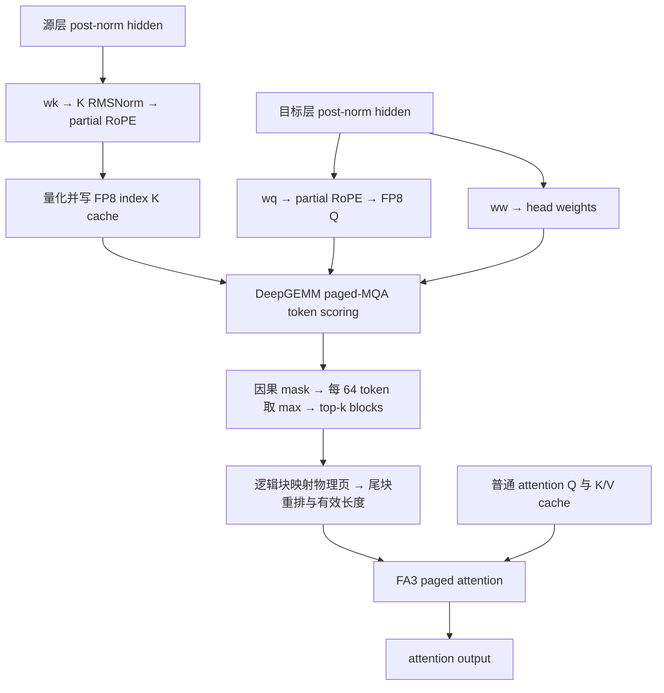

---
tags:
  - projects/sglang
  - topics/sparse-attention
  - topics/source-reading
date: 2026-09-18
---

# WeLM DSA forward：Indexer、Selection 与 FA3

初次梳理：2026-09-09，源码提交 `c54c2f36bf65745a03e598cb7285b68d34884ade`。本次整理与核对：2026-09-18，本地 HEAD `1be729ea71af95807c55d4c845f72a18cd0124b3`。两次提交之间 `welm_dsa.py` 与 `flashattention_backend.py` 没有差异；模型入口定位按本次 checkout 核对。

Q heads、共享 Selection、计算形状与已有采样记录见 [主 Attention 的计算形状](welm-dsa-small-heads.md)。

源码根目录是本机 `/Users/kuangjux/codes/sglang-welm-sparse-attn`。下文用仓库相对路径、符号和行号定位代码，避免把依赖本机目录的链接发布成网站死链。文中本地版本不代表 upstream 最新实现。

本文只梳理 DSA forward 的两部分及其 kernel 调用，普通 attention QKV 的生成作为输入边界。基于本地源码静态阅读，没有运行 GPU 推理或采集 kernel trace；下文区分专用 kernel、PyTorch 算子和外部库接口，不将一个 Python 函数等同于一次 GPU launch。

## 1. 总览与入口

**Indexer 选出历史 token 块；Sparse Attention 用普通 Q/K/V 在这些块上计算 attention。** 两部分使用不同的 Q/K，indexer 没有 V。



实际模型入口在 Qwen2MoeAttention.forward（`python/sglang/srt/models/welmv4.py:5281`）：

1. 源层在普通 QKV 投影之前调用 `indexer.store_key(hidden_states, positions, forward_batch)`，见 L5352（`python/sglang/srt/models/welmv4.py:5352`）。
2. 目标层调用 `indexer.select(...)`，返回 `dsa_page_table`、`dsa_cache_seqlens`、`dsa_cu_seqlens_q`，见 L5648（`python/sglang/srt/models/welmv4.py:5648`）。
3. 普通 `q/k/v` 和上述三个张量一起传入 `self.attn(...)`，见 L5655（`python/sglang/srt/models/welmv4.py:5655`），最后到 `FlashAttentionBackend._forward_welm_dsa()`。

`use_dsa=True` 且该层 `sparse_blk_siz_layerwise > 0` 才创建 indexer。初始化（`python/sglang/srt/models/welmv4.py:4812`）

若启用 `dsa_indexer_kv_mirror`，`wk` 使用 mirror 源层的 hidden，但仍使用**目标 indexer 自己的投影权重，并写入目标 indexer 的 cache**；`wq/ww` 使用目标层 hidden。绑定逻辑在 _bind_dsa_indexers（`python/sglang/srt/models/welmv4.py:6921`）。

## 2. Indexer：按调用顺序看 kernel

记 `N` 为当前 query 行数，`H` 为 indexer heads，`D=128`，`P=64` 为每块 token 数，`K=config.dsa_indexer_topk` 为选择块数。普通 attention 的 head 数和 head dim 不使用这里的 `H/D`。

| 步骤 | 调用／kernel | 输入 → 输出与职责 |
| --- | --- | --- |
| K 投影 | `wk` → `ReplicatedLinear` → `F.linear` | 源 hidden `[N_key,hidden_size]` → index K `[N_key,128]`；BF16、无量化、attention TP 间复制 |
| K norm | `welm_dsa_rms_norm`，PyTorch 算子 | FP32 转换、平方均值、rsqrt、乘 gamma，再转回输入 dtype |
| K RoPE | `welm_dsa_apply_partial_rope`，PyTorch 算子 | 对前 `rope_dim` 维做 NeoX half-split 旋转，其余维保持不变 |
| K 量化＋写 cache | `fused_store_index_k_cache` → CUDA `fused_store_indexer_cache` | 一次专用 kernel 完成每条 128 维 K 的 FP8 量化及按物理 slot 写入 K/scale |
| K store fallback | Triton `_act_quant_kernel` → `_set_k_and_s_triton_kernel` | fused store 不可用时，量化和写 cache 分开执行 |
| Query 页表对齐 | `_query_batch_ids`、`align_dsa_query_page_table`，PyTorch 算子 | 请求页表 `[B,M]` → 每 query 一行的完整页表 `[N,M]`；结合当前物理 cache slot 校验／修复请求归属 |
| Q 与权重投影 | `wq`、`ww` → `F.linear` | 目标 hidden → `[N,H,128]` 与 `[N,H]`；两次独立 BF16 投影 |
| Q RoPE、head padding | partial RoPE、`pad_dsa_heads_for_deepgemm` | Q 做部分旋转，Q/weights 的 head 维补零到 32 或 64 |
| Q 量化 | `act_quant` → Triton `_act_quant_kernel` | Q → E4M3 Q `[N,H_kernel,128]` 和 FP32 scale `[N,H_kernel,1]` |
| 权重缩放 | PyTorch 乘法 | `weights *= q_scale * score_scale`，结果为 FP32 |
| 打分调度 | `deep_gemm.get_paged_mqa_logits_metadata` | 根据各 query 可见长度、page size、SM 数生成调度 metadata |
| Token scoring | `deep_gemm.fp8_paged_mqa_logits` | 读 FP8 Q、index K cache、完整页表，输出 FP32 token logits `[N_chunk,M*64]` |
| 选块 | `select_topk_blocks`，PyTorch `masked_fill → amax → topk` | 先屏蔽未来 token，再每 64 token max pooling，得到逻辑块号 `[N,K]`，无效位置为 `-1` |
| 转换 attention metadata | `build_sparse_page_table`，PyTorch `gather/argsort/reduce`；`arange` | 生成物理页表 `[N,K]`、稀疏 KV 长度 `[N]`、Q 累积长度 `[N+1]` |

源码入口：store_key（`python/sglang/srt/layers/attention/welm_dsa.py:430`）、select（`python/sglang/srt/layers/attention/welm_dsa.py:604`）、_select_paged（`python/sglang/srt/layers/attention/welm_dsa.py:548`）。线性层的无量化 CUDA 路径落到 F.linear（`python/sglang/srt/layers/quantization/unquant.py:148`）；具体 GEMM 设备符号由 PyTorch 后端和形状决定。

### 2.1 Index K cache：只融合量化与写入

CUDA kernel（`python/sglang/jit_kernel/csrc/nsa/fused_store_index_cache.cuh:38`） 中每个 warp 处理一条 K，每 lane 读取 4 个元素，通过 warp max 得到：

```text
scale = max(max(abs(key)), 1e-4) / 448
key_fp8 = FP8_E4M3(key / scale)
page = physical_slot // 64
offset = physical_slot % 64
```

每页实际字节布局是：

```text
[64 × 128 bytes 的 FP8 keys][64 × 4 bytes 的 FP32 scales]
```

这套 cache 由 WeLMDsaMHATokenToKVPool（`python/sglang/srt/mem_cache/memory_pool.py:1173`） 管理。不是把每个 token 的 key 和 scale 交错存储；后面 `view(-1,64,1,132)` 只是给 DeepGEMM 传递 ABI 形状。

`wk`、RMSNorm、RoPE 都在 fused store **之前**完成。Q 量化以及 K fallback 量化的实现见 _act_quant_kernel（`python/sglang/srt/layers/attention/nsa/triton_kernel.py:9`），fallback 的 cache scatter 见 _set_k_and_s_triton_kernel（`python/sglang/srt/layers/attention/nsa/index_buf_accessor.py:476`）。

### 2.2 DeepGEMM 输出的是 token 分数

忽略 FP8 量化误差，打分公式是：

```text
score[t,s] = score_scale × Σ_h weights[t,h] × ReLU(dot(q_index[t,h], k_index[s]))
score_scale = (H × 128)^(-1/2)  # 启用 dsa_indexer_score_scaling 时；否则为 1
```

`weights` 来自 `ww`，这里没有 softmax 或 sigmoid；Q 也没有 indexer RMSNorm。Q scale 先乘进 weights，K scale 由打分 kernel 消费。核心接口为：

```python
schedule = deep_gemm.get_paged_mqa_logits_metadata(lens, 64, deep_gemm.get_num_sms())
logits = deep_gemm.fp8_paged_mqa_logits(
    q_fp8[start:end].unsqueeze(1),  # [N_chunk,1,H_kernel,128]
    cache,                        # FP8 index K + FP32 scale 的分页存储
    weights[start:end],            # 已合并 Q scale 与 score_scale
    lens,                         # [N_chunk,1]，每行 query_position+1
    pages, schedule, max_seq_len,
    clean_logits=False,
)
```

这是 L578 起的调用（`python/sglang/srt/layers/attention/welm_dsa.py:578`） 的简化摘录。此接口融合点积、ReLU、head 加权与归约；**64-token pooling 和 top-k 仍在后面的 PyTorch 算子中**，没有融合进此处的 DeepGEMM 调用。

`clean_logits=False` 是因为调用处注明 cleanup 不支持这里的二维 lengths，因此后续必须显式屏蔽不可见 token。`SGLANG_WELM_DSA_LOGITS_MB` 默认 256，用于按 query 行切分 logits；它是单 chunk logits 的大小目标，并非整个 forward 的显存上限。

### 2.3 选块与页表：两部分之间的接口

select_topk_blocks（`python/sglang/srt/layers/attention/welm_dsa.py:95`） 的核心顺序是：

```python
visible = token_ids[None, :] < context_lens[:, None]
block_scores = logits.masked_fill(~visible, -float("inf")).view(N, M, 64).amax(-1)
selected = block_scores.topk(min(K, M), dim=-1).indices
```

先 mask 再 pooling，避免当前尾块尚未写入的 token 参与 max。`topk` 选的是**逻辑块号**；之后根据每行有效块数屏蔽并补齐为 `[N,K]`。没有强制选中当前块。

build_sparse_page_table（`python/sglang/srt/layers/attention/welm_dsa.py:129`） 用完整请求页表 gather 出物理页号，按“其他有效块 → 当前块 → 无效 padding”稳定重排。当前块若被选中，必须放在最后一个有效页，才能用一个总长度表达尾块只读多少 token。

```text
context_len = 130，request_pages = [10,11,12,13]
selected = [2,0,1,-1]
    → physical pages = [10,11,12,-1]，cache_len = 64+64+2 = 130
selected = [0,1,-1,-1]
    → physical pages = [10,11,-1,-1]，cache_len = 128
```

因此 `cache_len` 是**选中集合的有效 token 总数**，不一定等于原请求长度或 `K*64`。其他完整块不必按时间排序；构造过程只改页表，没有把普通 K/V 复制成连续的稀疏 cache。

## 3. Sparse Attention：把稀疏页表交给 FA3

`forward_extend` 和 `forward_decode` 都检查 `dsa_page_table`，随后转入同一个 _forward_welm_dsa（`python/sglang/srt/layers/attention/flashattention_backend.py:4461`）。在这之前，需要写入的普通 K/V 已由 backend `set_kv_buffer` 或更早的模型融合路径写好；DSA FA3 调用本身没有传入新 `k/v`。

核心调用的简化形式：

```python
flash_attn_with_kvcache(
    q=q.contiguous().view(N, Hq, Dq),         # 普通 attention Q
    k_cache=key_cache,                       # [num_pages,64,Hkv,Dq]
    v_cache=value_cache,                     # [num_pages,64,Hkv,Dv]
    page_table=pages,                        # [N,K] 物理页号
    cache_seqlens=cache_lens,                # [N] 稀疏 KV 有效长度
    cu_seqlens_q=torch.arange(N + 1),        # 每个 query 是长度为 1 的序列
    cu_seqlens_k_new=None,
    max_seqlen_q=1,
    softmax_scale=layer.scaling,
    causal=False,
    window_size=(-1, -1),
    softcap=layer.logit_cap,
    num_splits=self.num_splits,
    ver=3,
    # 若配置了 attention sink，另传 sinks
)
```

FA3 通过页表读取选中块中的普通 K/V，完成 QK、softmax 和加权 V，返回 `[N,Hq,Dv]`，backend 再 view 为 `[N,Hq*Dv]`。Indexer 分数只用于选块，不作为 FA3 的 attention logits 或额外权重。

**为什么 `causal=False`？** 因果性已编码在“每个 query 独立的页表＋尾块长度”中：选块时屏蔽未来 token，FA3 只读该 query 可见的选中集合。即使是多 token prefill，这里也把每个 query 展开成单独一行；不能再依靠压缩页表中的下标代表原始时间位置。

FA3 kernel 的本地分发链是：

```text
FlashAttentionBackend._forward_welm_dsa
  → jit_kernel/flash_attention.py::flash_attn_with_kvcache(ver=3)
  → jit_kernel/flash_attention_v3.py::flash_attn_with_kvcache
  → 默认：sgl_kernel.flash_attn.flash_attn_with_kvcache
  → torch.ops.sgl_kernel.fwd.default
```

入口证据：版本分发（`python/sglang/jit_kernel/flash_attention.py:135`）、FA3 加载器（`python/sglang/jit_kernel/flash_attention_v3.py:31`）、CUDA 扩展调用（`sgl-kernel/python/sgl_kernel/flash_attn.py:190`）。`SGLANG_USE_SGL_FA3_KERNEL` 默认 True（`python/sglang/srt/environ.py:440`）；关闭后尝试加载 `kernels-community/sgl-flash-attn3`，失败回退到 sgl-kernel。具体设备模板和 launch 数量取决于安装版本、形状与 split 配置，本文没有用 trace 确认。

## 4. Prefill／Decode 的关键分支

| 场景 | Indexer | Sparse attention |
| --- | --- | --- |
| Eager，整批 `max(context_lens) <= K*64` | 直接选择所有可见块，跳过 `wq/ww`、Q 量化和 DeepGEMM scoring；源层 `store_key` 仍执行 | 仍走同一个 FA3 稀疏页表接口 |
| 长上下文 prefill／extend | 各 token 按自身 position 取长度，统一使用 paged-MQA scoring，按 query 行切 chunk | 每个 query 单独的页表与长度，`max_seqlen_q=1` |
| 长上下文 decode | 当前 query 读取历史 index K，仍用同一个 paged-MQA scoring | 仍用普通 paged K/V + FA3 |
| CUDA Graph capture | 禁用短上下文捷径，记录 selector 路径，避免重放到长上下文时遗漏打分 | 接口不变 |

当前代码边界：indexer dim 128、block/page size 64；K 从配置读取，注释中的 32 不是硬编码；attention 要求 MHA/GQA FA3，禁止 attention CP，indexer 绑定要求 PP=1；MTP selector 只接受 EAGLE top-k=1 的线性 verify 布局，这个 top-k 与稀疏块数 K 是不同参数。

相关逻辑可对照 `test/registered/unit/models/test_welm_dsa.py`：包含请求页表对齐、Norm/RoPE、head padding、选块、尾块长度测试。本文仅阅读测试，没有将这些 CPU 逻辑测试视为 DeepGEMM/FA3 的 GPU 数值验证。

更细的推导可继续读已有的 `reading_notes/welm_dsa.md` 和 `reading_notes/lightning_indexer_kernels.md`；后者的外部 DeepGEMM 快照版本与实际服务器安装版本需分别看待。


## 5. 当前配置中的三种 head 与共享关系

| 概念 | 既有采样中的数量 | 职责 |
| --- | ---: | --- |
| 主 Attention 本地 Q heads | 12 | 每个 head 独立计算 attention 分布和输出 |
| 主 Attention 本地 KV heads | 1 | 给上述 12 个 Q heads 提供同一组 K/V 向量 |
| Indexer Q heads | 8，当前 DeepGEMM ABI 补到 32 | 点积、ReLU、加权后沿 head 归约成 token score |

这里的 12/1 来自当时全模型 24/2 的 attention TP 分片，D=256；不是所有部署配置。GQA 共享 K/V 与 DSA 共享 Selection 是两个独立事实。

当前 `WeLMLightningDsaIndexer.__init__` 要求 `dsa_indexer_n_heads_block == 1`，对应一份共享 Selection（`welm_dsa.py:341`）。选择结果形状是 `[N_query, topk_blocks]`，没有主 Attention head 轴；同一个 query 的各主 Attention heads 选中的 token IDs 相同，各自的 Q、attention 权重和输出仍然不同。

`wq/wk/ww` 为 BF16 ReplicatedLinear（`welm_dsa.py:350` 起），用于 attention TP 间一致的选块语义。共享选中的 token IDs 不等于不同 KV heads 的向量值相同。

## 6. 主 Attention 的现有接口边界

`FlashAttentionBackend._forward_welm_dsa` 接收普通 Q、已构建的稀疏页表、有效长度和 Q 累积长度，从 token-to-KV pool 取得当前层 K/V，再调用 `flash_attn_with_kvcache`。`forward_extend` 与 `forward_decode` 都转入这个辅助函数。

| 接口内容 | 当前代码行为 |
| --- | --- |
| 选块 | 在进入辅助函数前完成，FA3 不执行 indexer 或 top-k |
| Q / K / V | 普通主 Attention 张量，不是 indexer 的投影结果 |
| 页表与长度 | FA3 读取选中物理页，`cache_seqlens` 描述选中集合的有效长度 |
| 因果性 | 每 query 的选块与尾页长度编码可见范围，调用设置 `causal=False` |
| 数值参数 | 传入 `layer.scaling`、`layer.logit_cap`；配置 sinks 时另传 `sinks` |
| 输出 | 可传入预分配的 `out`，返回结果 view 为 `[N,Hq*Dv]` |
| Kernel 版本 | 明确要求 `fa_impl_ver == 3`、MHA/GQA 路径及 page size 64 |

以上边界由 `flashattention_backend.py:4461` 至 `:4511` 的调用代码确认；它描述现有实现，不指定设备端的 MMA 形状或流水线。

## 7. 原始资料与阅读顺序

1. 先沿本文的 `store_key → select → build_sparse_page_table → _forward_welm_dsa` 阅读本地源码。
2. 再读 [Q heads、共享 Selection 与计算形状](welm-dsa-small-heads.md)，对照张量语义和既有采样记录。
3. 如需逐行展开，原仓库保留 `reading_notes/welm_dsa.md` 和 `reading_notes/lightning_indexer_kernels.md`。
4. 原 profile 的采样配置、截图与归因见原仓库 `reading_notes/dsa_profiling_and_optimization.md` 和 `reading_notes/data/dsa_profile_metrics.json`。这些是旧采样，不能当成本次重新测得的优化收益。

本文与 [DeepSeek DSA 算法笔记](../../notes/llm/deepseek-dsa/deepseek-sparse-attention-dsa.md)互补：WeLM 此处的 block selection、GQA、FP8 index cache 和 FA3 接入由本地代码决定，不能直接套用 DeepSeek MLA 的 KV 几何形状或 FlashMLA head padding 限制。
