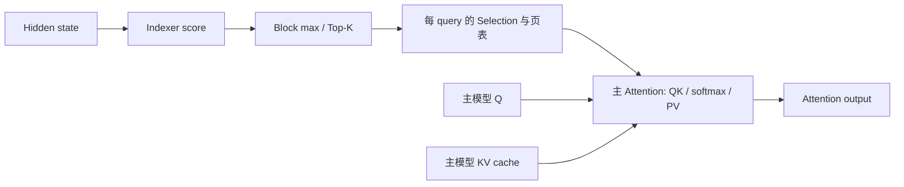

---
tags:
  - topics/sparse-attention
  - projects/sglang
date: 2026-09-18
---

# WeLM DSA：Q heads、共享 Selection 与主 Attention 的计算形状

本文记录当前 WeLM DSA 的源码行为、对应的矩阵形状和已有 profile 中的观测。配套调用链见 [WeLM DSA forward：Indexer、Selection 与 FA3](welm-dsa-forward.md)。

源码核对版本为本地 SGLang 提交 `1be729ea71af95807c55d4c845f72a18cd0124b3`，根目录为 `/Users/kuangjux/codes/sglang-welm-sparse-attn`。下文的路径相对此目录。采样数据来自 2026-09-09 的历史记录，其源码版本和条件另列；本次只整理笔记，没有重新运行 GPU 测试。

## 1. Indexer score 与主 Attention 是两部分

| 部分 | 输入 | 产物 | 当前实现 |
| --- | --- | --- | --- |
| Indexer score | 独立投影的 index Q/K、head weights | 每 query 对历史 token 的相关性分数 | DeepGEMM FP8 paged-MQA logits |
| 选块 | Indexer token scores | 每 query 的逻辑 KV block IDs | 因果 mask、block max、top-k |
| 主 Attention | 主模型 Q/K/V、选中的 KV 页 | softmax 加权后的 V | FA3 paged attention |

两处的 Q/K 是不同张量。Indexer 的多个 heads 参与相关性打分与归约；主 Attention 的各个 Q heads 独立产生 attention 权重和输出。Indexer 分数用于选块，不作为主 Attention 的 logits 或权重传入 FA3。

源码定位：`python/sglang/srt/layers/attention/welm_dsa.py:548` 的 `_select_paged`，以及 `python/sglang/srt/layers/attention/flashattention_backend.py:4461` 的 `_forward_welm_dsa`。

## 2. 12 个 Q heads 来自哪份配置？

已有采样记录对应：

| 参数 | 当时的配置 |
| --- | ---: |
| 主模型总 Q / KV heads | 24 / 2 |
| 本 rank 的主 Attention Q / KV heads | 12 / 1 |
| 主 Attention head dimension | 256 |
| Indexer Q heads / dimension | 8 / 128 |
| KV block size | 64 tokens |
| 选择的 KV block 数上限 | 32 |

这些数值来自 `reading_notes/dsa_profiling_and_optimization.md` 的采样配置记录，不是所有 WeLM 部署的固定参数。该记录结合模型代码与 TP/DP 配置确认本地 head 数；原 trace 没有启用 `record_shapes`，不能仅由 trace 推出这些形状。

模型中本地 Q heads 由总 Q heads 除以 attention TP size 得到；KV heads 在足够多时按 attention TP 切分，不足时复制。见 `python/sglang/srt/models/welmv4.py:4738`。因此这里应使用 attention TP，而不是直接把其他并行维度当作分母。

Indexer 的 8 个 heads 是另一套参数。当前 `pad_dsa_heads_for_deepgemm` 会把不足 32 的 index heads 补到 32；它不表示主 Attention 的 12 个 heads 也在 Python 层补到 32。见 `welm_dsa.py:74`。

## 3. 同一个 token 的 12 个 Q heads 共享哪些内容？

在上述本地 12/1 配置中：

1. 这 12 个 Q heads 对应同一个 KV head，使用同一组 K/V 向量。
2. 当前 WeLM DSA 为每个 query 生成一份共享 Selection，因此它们还访问相同的历史 token IDs。

第一项是 GQA 的 head 映射；第二项是该 DSA 实现的选块语义。两者需要分别确认。

源码证据：

- `welm_dsa.py:341` 要求 `dsa_indexer_n_heads_block == 1`，错误信息为 “one shared selection head”。
- `welm_dsa.py:95` 的 `select_topk_blocks` 接受二维 token scores，返回 `[N_query, topk_blocks]`，没有主 Attention head 轴。
- `welm_dsa.py:350` 起的 `wq/wk/ww` 使用 BF16 `ReplicatedLinear`，代码注释说明 Selection 在 attention TP ranks 之间共享。
- `flashattention_backend.py:4493` 把这一份 query 页表交给主 Attention。

用 $S_t$ 表示 query token t 的选中集合，在不写出 sink、softcap 等额外项的基本 Attention 表达式中：

$$
o_{t,h}=\operatorname{softmax}\left(q_{t,h}K_{S_t}^{\top}/\sqrt d\right)V_{S_t}.
$$

集合是 $S_t$，不带主 Attention head 下标。各个 $q_{t,h}$ 不同，因此共享 K/V 和位置不要求 attention 分数、权重或输出相同。

全模型的两个 KV heads 具有不同的 K/V 向量。共享 token IDs 不代表这两组向量相同，也不能把全模型 24 个 Q heads 当作对同一份 K/V 的 24 行。

## 4. 12 个 heads 对应的矩阵形状

固定一个 query token 和一个完整的 64-token KV block：

$$
Q_t\in\mathbb R^{12\times256},\qquad K_b,V_b\in\mathbb R^{64\times256}.
$$

Q 的每一行是一个 head 的向量。这里没有沿 head 求和，也没有把它们视为一个 3072 维向量。QK 的数学形状是：

$$
S_{t,b}=Q_tK_b^\top\in\mathbb R^{12\times64}.
$$

每个 head 的 softmax 在全部选中 KV tokens 上归一化。设 $P_{t,b}$ 为完整归一化权重在 block b 上的切片，则这个 block 对输出的贡献是：

$$
O_{t,b}=P_{t,b}V_b\in\mathbb R^{12\times256},\qquad O_t=\sum_b O_{t,b}.
$$

各个 block 独立 softmax 后直接相加，一般不等价于上述计算。这里的矩阵是数学形状，不是对实际 FA3 指令、tile 或线程布局的描述；从 `[12,64]` 不能直接推出设备指令 padding 到多少行。

## 5. Prefill 的多个 query 如何进入当前 FA3？

`WeLMLightningDsaIndexer.select` 返回：

| 张量 | 形状或取值 | 含义 |
| --- | --- | --- |
| `page_table` | `[N_query, topk_blocks]` | 每个 query 选中的物理 KV 页 |
| `cache_seqlens` | `[N_query]` | 选中集合内的有效 token 总数 |
| `cu_seqlens_q` | `[0,1,...,N_query]` | 每个 query 作为长度为 1 的序列 |

构造位置见 `welm_dsa.py:704` 起。`_forward_welm_dsa` 调用 FA3 时设置 `max_seqlen_q=1`，见 `flashattention_backend.py:4501`。

这表示一次 prefill 有很多 query 行，但它们在此接口中分别携带独立的稀疏页表。不同 query 的 Selection 不要求相同。主 Attention 沿各自页表读取 K/V；这里没有在 Python 侧把多个 query 的选块合并成共同集合。

普通矩阵乘法的各行共享右操作数。若两个 query 的紧凑 KV 列表不同，将 Q 的行直接堆叠，并不使它们成为对同一个紧凑 K 矩阵的乘法。这个数学约束解释了“多个 query 行”和“多行共享同一 KV 矩阵”为什么不能等同；它本身不是对 FA3 性能瓶颈的测量。

## 6. Decode 与 Verify 的现有接口行为

`forward_extend` 和 `forward_decode` 在收到 `dsa_page_table` 时，都调用 `_forward_welm_dsa`。单 query 的页表和有效长度契约相同，见 `flashattention_backend.py:4653` 与 `:5258`。

MTP verify 可以让一个请求对应多个 query 行；当前 selector 明确只接受 EAGLE top-k=1 的线性 verify 布局，见 `welm_dsa.py:630`。这个 top-k 是候选树分支参数，不是表中的 32 个稀疏 KV blocks。

多个候选 query 使用同一个请求的历史 KV cache，不要求各自的 Selection 相同。当前每 query 页表的表示方式仍然适用。仅由阶段名称或 query 数，不能确定 kernel 是 memory-bound 还是 compute-bound。

## 7. 已有 profile 实际记录了什么？

以下数据摘自 `reading_notes/dsa_profiling_and_optimization.md` 第 4 节，原始汇总为 `reading_notes/data/dsa_profile_metrics.json`。采样日期为 2026-09-09，源码版本为 `c54c2f36bf65745a03e598cb7285b68d34884ade`；单请求输入 16,229 tokens、输出 16 tokens，prefill 按 2,048-token chunk 推进，关闭 CUDA Graph。数值属于所选 rank 和带 profiler 的采样。

| 观测对象 | Prefill：第二个 step 的 L0 | Decode：第一个 step 的 L0 |
| --- | ---: | ---: |
| Sparse Attention GPU annotation 跨度 | 868.965 μs | 114.755 μs |
| 关联 kernel duration 累计 | 804.931 μs | 22.176 μs |
| FA3 主计算 kernel duration | 769.219 μs | 11.360 μs |

GPU annotation 跨度与关联 kernel duration 累计不是同一指标。前者可以包含 kernel 之间的空隙；kernel duration 也不能跨重叠区间直接当作端到端延迟。Prefill 与 Decode 的工作量不同，表中数字不是同条件速度比较。

这些记录说明所选 prefill 调用中 FA3 主 kernel 占关联 kernel 时间的主要部分，也说明所选 decode 范围不能全部归因于 FA3 数学计算。它们没有给出 head 数扫描、指令级利用率或同计算量 baseline，因此不能独立证明“少 head 导致至少慢一倍”或某种指令映射的加速比。

## 8. 关联资料

- [WeLM DSA forward 与源码定位](welm-dsa-forward.md)：调用链、缓存布局、选块与页表语义、FA3 接口。
- [DeepSeek DSA 算法流程](../../notes/llm/deepseek-dsa/deepseek-sparse-attention-dsa.md)与 [MSA / DSA indexer 对照](../../notes/llm/minimax-msa/msa-vs-dsa-indexer.md)：算法背景；其中的模型参数与 Selection 设计不能替代 WeLM 的代码事实。
- 原源码仓库的 `reading_notes/welm_dsa.md`、`reading_notes/lightning_indexer_kernels.md` 与 `reading_notes/dsa_profiling_and_optimization.md`：逐行解读与既有采样记录。
